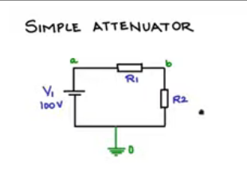
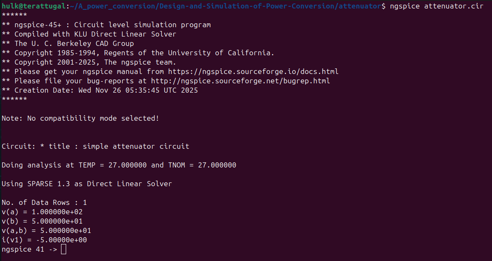
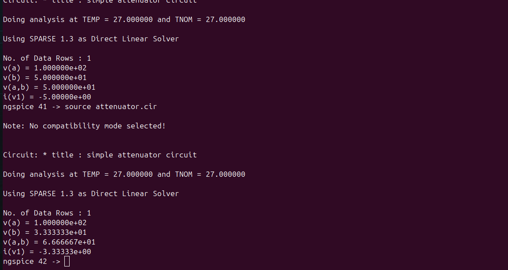

# Attenuator



# Code

*attenuator.cir*

```cir
* Title : Simple attenuator circuit

* Netlist
V1 a 0 100v
R1 a b 10
R2 b 0 10

* Control commands
.control
op
print v(a) v(b) v(a,b) i(v1)
.endc
.end
```

# Steps

*after installing ngspice*

> ngspice attenuator.cir



# If Update any value

*changing the resistor (R1) value from 10 ohm to 20 ohm.*

# Code

*attenuator.cir*

```cir
* Title : Simple attenuator circuit

* Netlist
V1 a 0 100v
R1 a b 20
R2 b 0 10

* Control commands
.control
op
print v(a) v(b) v(a,b) i(v1)
.endc
.end
```

> *source attenuator.cir*

