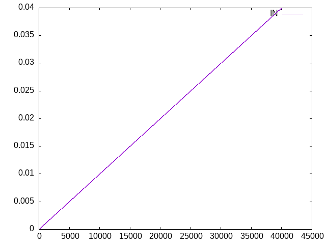

# Attenuator

This is a simple 10k–10k resistive attenuator.

## Circuit
- Input: 10 V peak, 1 kHz sine
- Output: ~5 V peak (50% attenuation)

## Output Waveform
The waveform is auto-generated by GitHub Actions:

