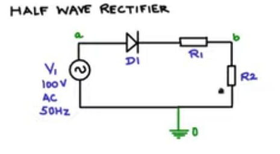
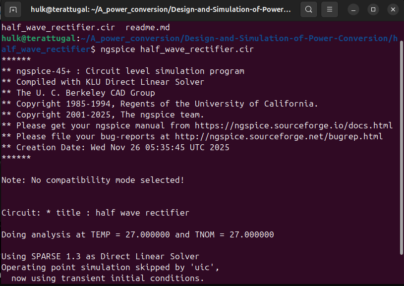
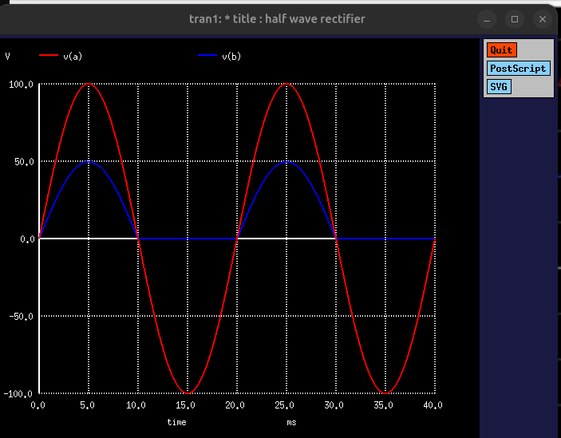
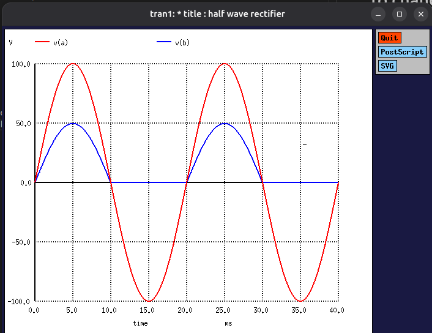

# Half Wave Rectifier



# Code

*Code Arrangement Forms*

### Code Arrangement Form 1: 

*half_wave_rectifier.cir*

```cir
* Title : Half wave rectifier

* Netlist

V1 a 0 sin(0 100 50 0 0)
D1 a c dmodel
R1 c b 10
R2 b 0 10

* Model 
.model dmodel D()

* Control
.control 
tran 1us 40ms uic
plot v(a) v(b)
.endc
.end
```

### Code Arrangement Form 2: 

*half_wave_rectifier.cir*

```cir
* Title : Half wave rectifier

* Control
.control 
tran 1us 40ms uic
plot v(a) v(b)
.endc
.end

* Netlist

V1 a 0 sin(0 100 50 0 0)
D1 a c dmodel
R1 c b 10
R2 b 0 10

* Model 
.model dmodel D()

```

### Code Arrangement Form 3: 

*half_wave_rectifier.cir*

```cir
* Title : Half wave rectifier

* Transitent Analysis
.tran 1us 40ms uic


* Netlist

V1 a 0 sin(0 100 50 0 0)
D1 a c dmodel
R1 c b 10
R2 b 0 10

* Model 
.model dmodel D()


* Control
.control
run 
plot v(a) v(b)
.endc
.end

```

### Code Arrangement Form 4: 

*half_wave_rectifier.cir*

```cir
* Title : Half wave rectifier

* Transitent Analysis
.tran 1us 40ms uic

* Netlist
.include half_wave_rectifier.net

* Control
.control
run 
plot v(a) v(b)
.endc
.end
```


*half_wave_rectifier.net*

```net
* Netlist

V1 a 0 sin(0 100 50 0 0)
D1 a c dmodel
R1 c b 10
R2 b 0 10

.include diode

```


*diode.sub*

```sub
* Model 
.model dmodel D()

```



# To change background and foreground of Output


*half_wave_rectifier.cir*

```cir
* Title : Half wave rectifier

* Transitent Analysis
.tran 1us 40ms uic

* Netlist
.include half_wave_rectifier.net

* Control
.control
set color0 = white ; set background color white
set color1 = black ; set foreground color black
run 
plot v(a) v(b)
.endc
.end
```

