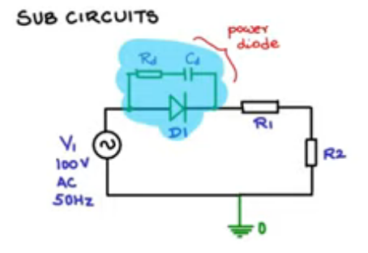
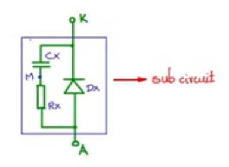

# Sub Circuits

 

```
.SUBCKT pwrdiode A K
DX A K dmod
RX A M 10k
CX M K 0.01uF
.model dmod D(Rs=0.01, CJO = 100pF)
.ENDS
```

# Code 

*half_wave_rectifier.cir*

```cir
* Title : Half wave rectifier

* Transitent Analysis
.tran 1us 40ms uic

* Netlist
.include half_wave_rectifier.net

* Control
.control
run 
plot v(a) v(b)
.endc
.end
```


*half_wave_rectifier.net*

```net
* Netlist

V1 a 0 sin(0 100 50 0 0)
xD1 a c pwrdiode
R1 c b 10
R2 b 0 10

* Model
.include pwr_diode.sub

```


*pwr_diode.sub*

```sub
* Model 
.model dmodel D()

```

